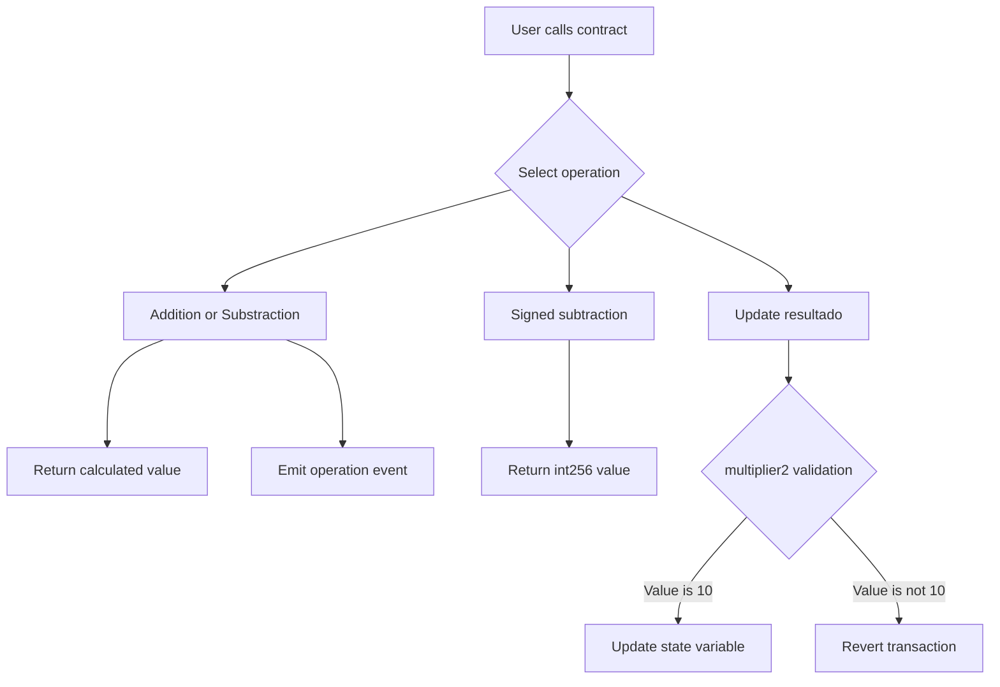

# Solidity Calculator

A Solidity-based calculator project that demonstrates arithmetic operations, state management, events, modifiers, visibility, and signed versus unsigned integers.

## Overview

`Calculadora` is a small, self-contained project designed to practice core smart contract concepts in a simple and inspectable codebase. It can be compiled and deployed locally with Remix IDE without requiring a wallet, testnet, or external service.

The contract provides a set of calculator operations while illustrating how Solidity handles persistent state, input validation, event emission, and different integer types. It combines functions that return calculated values with functions that update the on-chain variable `resultado`, making it a practical example of the difference between read-only computation and state-changing transactions.

## Conceptual Map



The diagram summarizes the main execution paths: arithmetic functions return values, event-enabled functions record activity, and state-changing functions update `resultado` after validation.

## Tech Stack

- **Solidity:** `0.8.24`
- **Development tool:** [Remix IDE](https://remix.ethereum.org/)
- **Execution environment:** Remix VM
- **License:** LGPL-3.0-only

## Project Files

| File | Description |
| --- | --- |
| `calculator.sol` | Solidity calculator contract using version `0.8.24`. |
| `Calculadora.sol` | Alternative contract version using Solidity `0.8.24`. |

## Contract API

| Function | Visibility | Purpose |
| --- | --- | --- |
| `Addition(uint256, uint256)` | `public` | Returns the sum and emits the `addition` event. |
| `Substraction(uint256, uint256)` | `public` | Returns an unsigned subtraction and emits the `substraction` event. |
| `substraction2(int256, int256)` | `public`, `pure` | Returns a subtraction using signed integers. |
| `multiplier(uint256)` | `public` | Updates the `resultado` state variable. |
| `multiplier2(uint256)` | `public` | Updates `resultado` only when the value is exactly `10`. |
| `substraction_logic(uint256, uint256)` | `internal`, `pure` | Internal helper for unsigned subtraction. |
| `substraction_logic2(int256, int256)` | `public`, `pure` | Returns a signed integer subtraction. |

The public state variable `resultado` is initialized to `10`. Solidity automatically generates a getter for it.

## Getting Started

1. Open [Remix IDE](https://remix.ethereum.org/).
2. Create a new `.sol` file and paste the contract contents.
3. Open **Solidity Compiler** and select compiler version `0.8.24`.
4. Compile the `Calculadora` contract.
5. Open **Deploy & Run Transactions**, select **Remix VM**, and click **Deploy**.
6. Interact with the deployed contract and inspect the emitted events in the console.

## Example Calls

```text
Addition(7, 3)       -> returns 10
substraction2(7, 10) -> returns -3
multiplier(25)       -> sets resultado to 25
multiplier2(10)      -> updates resultado successfully
multiplier2(5)       -> reverts the transaction
```

## Testing

The contract was manually tested in Remix IDE using Remix VM with the following scenarios:

- Valid addition returns the expected result.
- Signed subtraction supports negative results.
- `multiplier` updates the `resultado` state variable.
- `multiplier2(10)` passes validation and updates the state.
- `multiplier2(5)` fails validation and reverts the transaction.
- Unsigned subtraction reverts when the result would be negative.

## Key Concepts Demonstrated

- State variables and Solidity's automatically generated getters
- `public`, `internal`, and `pure` function visibility and mutability
- Custom modifiers for input validation
- Events for recording arithmetic operations
- The behavioral difference between `uint256` and `int256`
- Solidity 0.8.x arithmetic checks for unsigned underflow

## Scope and Limitations

- `Addition` and `Substraction` return their calculated values but do not update `resultado`.
- An unsigned subtraction reverts when the result would be negative.
- `checkNumber` only allows execution when its argument is exactly `10`.
- The project does not include an automated test suite, deployment scripts, or production security audits.
- This contract is intended for learning and portfolio demonstration only. It does not handle funds and should not be used in production.

## License

This project is distributed under the [LGPL-3.0-only](https://www.gnu.org/licenses/lgpl-3.0.html) license, as declared in the Solidity source files.

## Author

Virginia Villela | Blockchain Developer
